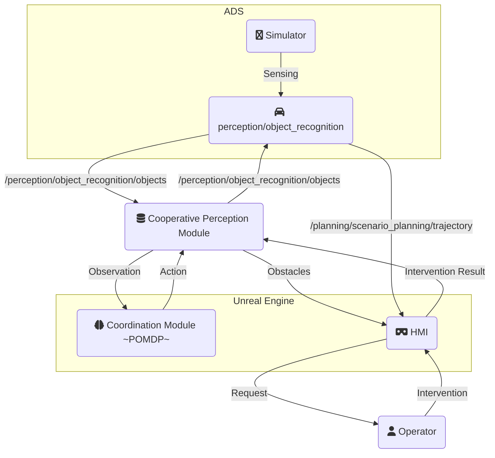

```mermaid
flowchart TD
    subgraph ADS
        A(fa:fa-car perception/object_recognition) 
        E(fa:fa-unity Simulator)
    end
    B(fa:fa-database Cooperative Perception Module)
    subgraph Unreal Engine
        C(fa:fa-brain Coordination Module ~POMDP~)
        D(fa:fa-vr-cardboard HMI)
    end

    F(fa:fa-user Operator)

    A -->|/perception/object_recognition/objects| B 
    B -->|/perception/object_recognition/objects| A
    B -->|Observation| C
    C -->|Action| B
    B -->|Obstacles| D
    D -->|Intervention Result| B
    A -->|/planning/scenario_planning/trajectory| D
    E -->|Sensing|A
    D -->|Request|F
    F -->|Intervention|D

```
